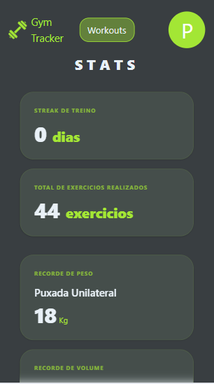
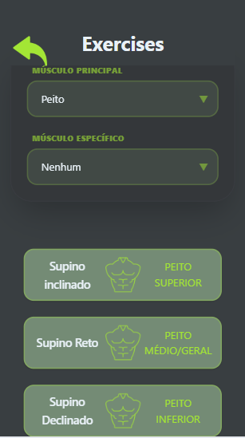
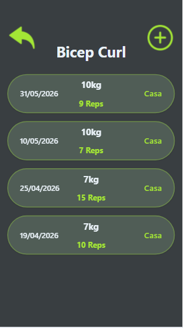
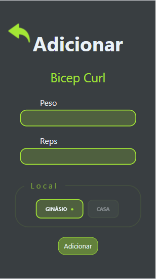

# Gym Tracker

🔗 [Live Demo](https://gym-tracker-mu-five.vercel.app)

**Gym Tracker** is a web app focused on tracking and logging strength training workouts. Developed to monitor user progress in a simple way.

## ScreenShots

---

## Main Features

- Full workout CRUD
- Exercises organized by muscle group
- Simple authentication system with Supabase Auth.

## Tech Stack

- React.js
- Supabase (DataBase)
- Tailwind CSS (UI)

---

## What I Learned

- **Supabase Integration:** Database management, including CRUD operations
- **Context API:** Centralized user and workout data with global state management
- **Data Security:** Implemented user-based filtering to ensure each user can only access and modify their own data